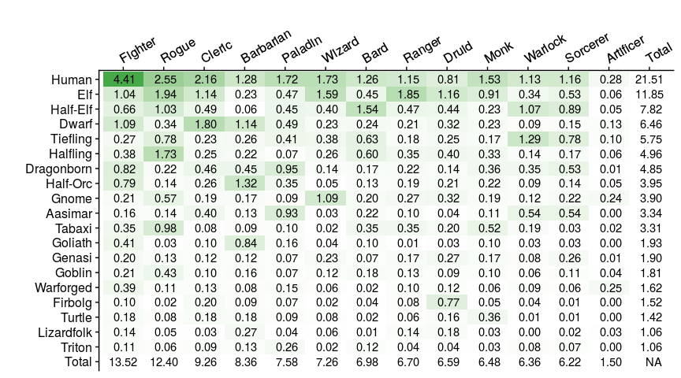
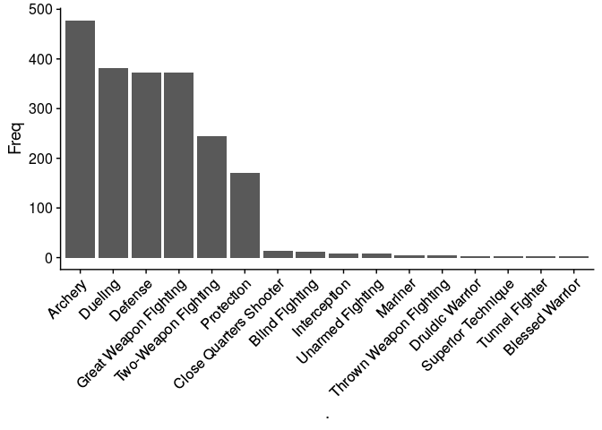

README
================

dnddata
=======

-   [dnddata](#dnddata)
    -   [Usage/installation](#usageinstallation)
    -   [Examples](#examples)
    -   [About the data](#about-the-data)
        -   [Column/element description](#columnelement-description)
        -   [Caveats](#caveats)
            -   [Possible Issues with data fields](#possible-issues-with-data-fields)
            -   [Possible issues with detection of unique characters](#possible-issues-with-detection-of-unique-characters)
            -   [Possible issues with selection bias](#possible-issues-with-selection-bias)

This is a weekly updated dataset of character that are submitted to my web applications [printSheetApp](https://oganm.com/shiny/printSheetApp) and [interactiveSheet](https://oganm.com/shiny/interactiveSheet). It is a superset of the dataset I previously released under [oganm/dndstats](https://oganm.github.io/dndstats) with a much larger sample (4120 characters) size and more data fields. It was inspired by the [FiveThirtyEight](https://fivethirtyeight.com/features/is-your-dd-character-rare/) article on race/class proportions and the data seems to correlate well with those results (see my [dndstats article](https://oganm.github.io/dndstats)).

Along with a simple table (an R `data.frame` in package), the data is also present in json format (an R `list` in package). In the table version some data fields encode complex information that are represented in a more readable manner in the json format. The data included is otherwise identical.

Usage/installation
------------------

If you are an R user, you can simply install this package and load it to access the dataset

``` r
devtools::install_github('oganm/dnddata')
library(dnddata)
```

Try `?tables`, `?lists` to see available objects and their descriptions

If you are not an R user, access the files within the [data-raw](data-raw) directory. The files are available as JSON and TSV. You can find the field descriptions [below](#columnelement-description). `dnd_chars_all` files contain all characters that are submitted while `dnd_chars_unique` files are filtered to include unique characters.

Examples
--------

I will be using the list form of the dataset as a basis here.

Let's replicate that plot from [fivethirtyeight](https://fivethirtyeight.com/features/is-your-dd-character-rare/) as I did in my [original article](https://oganm.github.io/dndstats/).

``` r
library(purrr)
library(ggplot2)
library(magrittr)
library(dplyr)
library(reshape2)

# find all available races
races = dnd_chars_unique_list %>% 
    purrr::map('race') %>% 
    purrr::map_chr('processedRace') %>%
    unique %>% {.[.!='']}

# find all available classes
classes = dnd_chars_unique_list %>% 
    purrr::map('class') %>%
    unlist(recursive = FALSE) %>%
    purrr::map_chr('class') %>% unique

# create an empty matrix
coOccurenceMatrix = matrix(0 , nrow=length(races),ncol = length(classes))
colnames(coOccurenceMatrix) = classes
rownames(coOccurenceMatrix) = races
# fill the matrix with co-occurences of race and classes
for(i in seq_along(races)){
    for(j in seq_along(classes)){
        # get characters with the right race
        raceSubset = dnd_chars_unique_list[dnd_chars_unique_list %>% 
                          purrr::map('race') %>% 
                          purrr::map_chr('processedRace') %>% {.==races[i]}]
        
        # get the characters with the right class. Weight multiclassed characters based on level
        raceSubset %>% purrr::map('class') %>% 
            purrr::map_dbl(function(x){
                x %>% sapply(function(y){
                    (y$class == classes[j])*y$level/(sum(map_int(x,'level')))
                }) %>% sum}) %>% sum -> coOcc
        
        coOccurenceMatrix[i,j] = coOcc
    }
}

# reorder the matrix a little bit
coOccurenceMatrix = 
    coOccurenceMatrix[coOccurenceMatrix %>% apply(1,sum) %>% order(decreasing = FALSE),
                            coOccurenceMatrix %>% apply(2,sum) %>% order(decreasing = TRUE)]

# calculate percentages
coOccurenceMatrix = coOccurenceMatrix/(sum(coOccurenceMatrix))* 100

# remove the rows and columns if they are less than 1%
coOccurenceMatrixSubset = coOccurenceMatrix[,!(coOccurenceMatrix %>% apply(2,sum) %>% {.<1})]
coOccurenceMatrixSubset = coOccurenceMatrixSubset[!(coOccurenceMatrixSubset %>% apply(1,sum) %>% {.<1}),]

# add in class and race sums
classSums = coOccurenceMatrix %>% apply(2,sum) %>% {.[colnames(coOccurenceMatrixSubset)]}
raceSums = coOccurenceMatrix %>% apply(1,sum) %>% {.[rownames(coOccurenceMatrixSubset)]}
coOccurenceMatrixSubset = cbind(coOccurenceMatrixSubset,raceSums)
coOccurenceMatrixSubset = rbind(Total = c(classSums,NA), coOccurenceMatrixSubset)
colnames(coOccurenceMatrixSubset)[ncol(coOccurenceMatrixSubset)] = "Total"

# ggplot
coOccurenceFrame = coOccurenceMatrixSubset %>% melt() 
names(coOccurenceFrame)[1:2] = c('Race','Class')
coOccurenceFrame %<>% mutate(fillCol = value*(Race!='Total' & Class!='Total'))
coOccurenceFrame %>% ggplot(aes(x = Class,y = Race)) +
    geom_tile(aes(fill = fillCol),show.legend = FALSE)+
    scale_fill_continuous(low = 'white',high = '#46A948',na.value = 'white')+
    cowplot::theme_cowplot() + 
    geom_text(aes(label = value %>% round(2) %>% format(nsmall=2))) + 
    scale_x_discrete(position='top') + xlab('') + ylab('') + 
    theme(axis.text.x = element_text(angle = 30,vjust = 0.5,hjust = 0)) 
```



Or try something new. Wonder which fighting style is more popular?

``` r
dnd_chars_unique_list %>% purrr::map('choices') %>% 
    purrr::map('fighting style') %>% 
    unlist %>%
    table %>% 
    sort(decreasing = TRUE) %>% 
    as.data.frame %>% 
    ggplot(aes(x = ., y = Freq)) +
    geom_bar(stat= 'identity') +
    cowplot::theme_cowplot() +
    theme(axis.text.x= element_text(angle = 45,hjust = 1))
```



About the data
--------------

### Column/element description

-   **ip:** A shortened hash of the IP address of the submitter

-   \*\*<finger:**> A shortened hash of the browser fingerprint of the submitter

-   **name:** A shortened hash of character names

-   **race:** Race of the character as coded by the app. May be unclear as the app inconsistently codes race/subrace information. See processedRace

-   **background:** Background as it comes out of the application.

-   **date:** Time & date of input. Dates before 2018-04-16 are unreliable as some has accidentally changed while moving files around.

-   **class:** Class and level. Different classes are separated by | when needed.

-   **justClass:** Class without level. Different classes are separated by | when needed.

-   **subclass:** Subclass. Might be missing if the character is low level. Different classes are separated by | when needed.

-   **level:** Total level

-   **feats:** Feats chosen. Mutliple feats are separated by | when needed

-   **HP:** Total HP

-   **AC:** AC score

-   **Str, Dex, Con, Int, Wis, Cha:** Ability score modifiers

-   **alignment:** Alignment free text field. Since it's a free text field, it includes alignments written in many forms. See processedAlignment, good and lawful to get the standardized alignment data.

-   **skills:** List of proficient skills. Skills are separated by |.

-   **weapons:** List of weapons, separated by |. This is a free text field. See processedWeapons for the standardized version

-   **spells:** List of spells, separated by |. Each spell has its level next to it separated by \*s. This is a free text field. See processedSpells for the standardized version

-   **castingStat:** Casting stat as entered by the user. The format allows one casting stat so this is likely wrong if the character has different spellcasting classes. Also every character has a casting stat even if they are not casters due to the data format.

-   **choices:** Character building choices. This field information about character properties such as fighting styles and skills chosen for expertise. Different choice types are separated by | when needed. The choice data is written as name of choice followed by a / followed by the choices that are separated by \*s

-   **country:** The origin of the submitter's IP

-   **countryCode:** 2 letter country code

-   **processedAlignment:** Standardized version of the alignment column. I have manually matched each non standard spelling of alignment to its correct form. First character represents lawfulness (L, N, C), second one goodness (G,N,E). An empty string means alignment wasn't written or unclear.

-   **good, lawful:** Isolated columns for goodness and lawfulness

-   **processedRace:** I have gone through the way race column is filled by the app and asigned them to correct races. Also includes some common races that are not natively supported such as warforged and changelings. If empty, indiciates a homebrew race not natively supported by the app.

-   **processedSpells:** Formatting is same as spells. Standardized version of the spells column. Spells are matched to an official list using string similarity and some hardcoded rules.

-   **processedWeapons:** Formatting is same as weapons. Standardized version of the weapons column. Created like the processedSpells column.

-   **levelGroup:** Splits levels into groups. The groups represent the common ASI levels

-   **alias:** A friendly alias that correspond to each uniqe name

The list version of this dataset contains all of these fields but they are organised a little differently, keeping fields like `spells` and `processedSpells` together.

### Caveats

#### Possible Issues with data fields

Some data fields are more reliable than others. Below is a summary of all potential problems with the data fields

-   **ip and browser fingerprints:** Both IP and browser fingerprints are represented as hashes. I keep them to have an idea of individual users but did not make use of them so far. Note that same IPs can be shared by an entire region in some cases.

-   **processedAlignment:** Alignment is a free text field in the app and optional. Many characters do not enter their alignments. To create the standardized alignment fields, I went through every entry and manually assigned every alternative spelling to the standardized version. These include mispelled entries, abreviations, entries in different languages etc. In cases where I wasn't able to match (eg. what the hell is "lawful cute"), this field was left blank. Between automatic updates new and exciting ways to describe alignment can come into play. Unless I manually added these new entries, they will also appear blank.

-   **processedSpells:** The mobile app allows entering free text into the spell fields. Which means I have to deal with people writing spells in a non-standard way with typos, abbreviations or additional information such as range, damage dice. I use some heuristics to match the entered text to a list of all published spells. Shortly, I look at the Levenshtein distance between the entry and the published spells and match the entry with the top result if
-   the spell level is correct and,
-   there are not more than 10 substitutions/deletions/insertions or either entry or the potential match includes all words that the counterpart includes.
-   In addition, there are special cases for Bigby's Hand, Tasha's Hideous Laughter and Melf's Acid Arrow as those spells are often written in their SRD form and match to wrong spells.

74% of all spells parsed did not require any modification. 22% of were only able to be matched through the heuristics. A manual examination of a random seleciton of these matches revealed 2/200 mistakes. 5% of the spell entries were not matched to an official spell. Manual observation of these entries revealed that the common reasons for a failure to match are users writing the spell under the wrong spell level, writing some class/race features such as blindsight as spells or adding/removing more than 10 charters when writing the spells either through abbreviation or adding additional information about the spell.

-   **processedWeapons:** Weapon names are also free text fields so a processing method similar to the one used for spells is used for weapon names. Instead of a threshold of 10 substititutions/deletions/insertions, 2 was used since weapon names typically did not include additional information like spell names did. Special cases were written for hand crossbow and heavy crossbow as they were typically mismatched to their official name (eg. "crossbow, hand"). Here the weapons that weren't matched were spell names or homebrew weapons.

80% of all weapons parsed did not require any modification. 14% of were only able to be matched through the heuristics. A manual examination of a random seleciton of these matches revealed 1/200 mistake. 6% of the weapon entries were not matched to an official weapon.

#### Possible issues with detection of unique characters

Identification of unique characters rely on some heuristics. I assume any character with the same name and class is potentially the same character. In these cases I pick the highest level character. Race and other properties are not considered so some unique characters may be lost along the way. I have chosen to be less exact to reduce the nubmer of possible test characters since there were examples of people submitting essentially the same character with different races, presumably to test things out. For multiclassed characters, if a lower level character with the same name and a subset of classes exist, they are removed, again leaving the character with the highest level.

#### Possible issues with selection bias

This data comes from characters submitted to my web applications. The applications are written to support a popular third party character sheet app for mobile platforms. I have advertised my applications primarily on Reddit r/dndnext and r/dnd. I have seen them mentioned in a few other platforms by word of mouth. That means we are looking at subsamples of subsamples here, all of which can cause some amount of selection bias. Some characters could be thought experiments or for testing purposes and never see actual game play.
